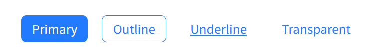

# say-bbo-ui

A modern React UI component library built with TypeScript, Emotion, and Vite.

**✨ Supports React 18 & 19**

### Development Status

- Button component is fully developed and ready for production use. Additional components will be added soon to expand the library's functionality.

### Available Components

- **Button** ✅ Complete (Primary, Outline, Underline, Transparent variants)
- **Modal** 🚧 In progress
- **Input** 📅 Coming soon
- **Select** 📅 Coming soon

## 📚 [View Components in Storybook →](https://ccimayoung.github.io/say-bbo-ui)

## 📚 [Github →](https://github.com/ccimayoung/say-bbo-ui)

## Features

- 🎨 **Modern Design**: Clean and accessible components
- ⚛️ **React 18 & 19**: Full compatibility with latest React versions
- 📦 **Tree Shaking**: Import only what you need
- 🎯 **TypeScript**: Full type safety
- 🎭 **Emotion**: CSS-in-JS styling
- 📚 **Storybook**: Interactive component documentation
- ⚡ **Vite**: Fast development and building
- 🔧 **Flexible**: Support for both CJS and ESM

## Installation

```bash
npm install say-bbo-ui
# or
yarn add say-bbo-ui
# or
pnpm add say-bbo-ui
```

### Peer Dependencies

Make sure you have these installed:

```bash
npm install react react-dom @emotion/react @emotion/styled
```

## Usage

### Import all components

```tsx
import React, { useState } from 'react';
import { Button, Modal } from 'say-bbo-ui';

function App() {
  const [isOpen, setIsOpen] = useState(false);

  return (
    <div>
      <Button onClick={() => setIsOpen(true)}>Open Modal</Button>
      <Modal isOpen={isOpen} onClose={() => setIsOpen(false)} title="My Modal">
        <p>Modal content here</p>
      </Modal>
    </div>
  );
}
```

### Import individual components

```tsx
// Recommended: Import from main entry (tree-shaking supported)
import { Button, Modal } from 'say-bbo-ui';

// Alternative: Import specific components if your bundler supports it
// import { Button } from 'say-bbo-ui/Button';  // May not work in all environments
```

## Tree Shaking

This library supports tree shaking out of the box with modern bundlers:

```tsx
// ✅ Only Button code will be included in your bundle
import { Button } from 'say-bbo-ui';

// ✅ Only Button and Modal code will be included
import { Button, Modal } from 'say-bbo-ui';
```

**How it works:**

- The library is built as ESM modules with proper `sideEffects: false`
- Modern bundlers (Webpack 5+, Vite, Rollup) automatically remove unused exports
- You only pay for what you use, even when importing from the main entry

**Supported bundlers:**

- ✅ Vite
- ✅ Webpack 5+
- ✅ Rollup
- ✅ esbuild
- ⚠️ Webpack 4 (limited support)

## Components

### Button

A versatile button component with multiple variants and sizes.



```tsx
import { Button } from 'say-bbo-ui';

// Basic usage
<Button label="Click me" onClick={handleClick} />

// With variants
<Button variant="primary" label="Primary Button" />
<Button variant="outline" label="Outline Button" />
<Button variant="underline" label="Underline Button" />
<Button variant="transparent" label="Transparent Button" />

// With sizes
<Button size="small" label="Small" />
<Button size="medium" label="Medium" />
<Button size="large" label="Large" />

// With icons
<Button startIcon={<Icon />} label="Start Icon" />
<Button endIcon={<Icon />} label="End Icon" />

// Disabled state
<Button disabled label="Disabled Button" />
```

**Props:**

- `label`: string - Button text content
- `variant`: 'primary' | 'outline' | 'underline' | 'transparent' (default: 'primary')
- `size`: 'small' | 'medium' | 'large' (default: 'medium')
- `disabled`: boolean
- `onClick`: () => void
- `startIcon`: ReactNode - Icon to display before text
- `endIcon`: ReactNode - Icon to display after text
- All standard button HTML attributes

### Modal

A modal dialog component with customizable size and behavior.

```tsx
import { Modal } from 'say-bbo-ui';

<Modal isOpen={isOpen} onClose={() => setIsOpen(false)} title="My Modal">
  <p>Modal content</p>
</Modal>;
```

**Props:**

- `isOpen`: boolean (required) - Controls modal visibility
- `onClose`: () => void (required) - Called when modal should close
- `title`: string - Modal title
- `children`: ReactNode - Modal content
- Additional props coming soon...

## Styling

### Theme

The library uses Emotion for styling with a built-in theme system:

```tsx
import { defaultTheme } from 'say-bbo-ui';

// Access theme colors, fonts, etc.
console.log(defaultTheme.colors.primary.main);
```

### Custom Styling

Components accept standard HTML attributes and can be styled with:

- CSS classes
- Emotion's `css` prop
- Styled components

## Development

### Prerequisites

- Node.js 18+
- npm/yarn/pnpm

### Setup

```bash
# Install dependencies
npm install

# Start development server
npm run dev

# Start Storybook
npm run storybook

# Build library
npm run build

# Type check
npm run type-check

# Lint
npm run lint
```

### Project Structure

```
say-bbo-ui/
├── src/
│   ├── components/          # React components
│   │   ├── Button/
│   │   └── Modal/
│   ├── types/              # TypeScript type definitions
│   ├── styles/             # Theme and styling utilities
│   └── index.ts            # Main entry point
├── dist/                   # Built files
│   ├── index.esm.js        # ESM build
│   ├── index.cjs.js        # CommonJS build
│   ├── index.d.ts          # Type definitions
│   └── components/         # Individual component builds
├── .storybook/             # Storybook configuration
└── package.json
```

## Browser Support

- Modern browsers that support ES2020
- React 18 or React 19

## Contributing

1. Fork the repository
2. Create a feature branch (`git checkout -b feature/amazing-feature`)
3. Make your changes
4. Add tests if applicable
5. Run `npm run lint` and `npm run type-check`
6. Commit your changes (`git commit -m 'Add amazing feature'`)
7. Push to the branch (`git push origin feature/amazing-feature`)
8. Open a Pull Request

## License

MIT License - see [LICENSE](LICENSE) file for details.

## Changelog

### v1.0.12

- ✨ Added React 19 support
- 🔧 Improved TypeScript auto-import with `typesVersions`
- 📦 Better tree shaking support

### v1.0.11

- 🐛 Fixed peerDependencies for React compatibility
- 📝 Updated documentation
